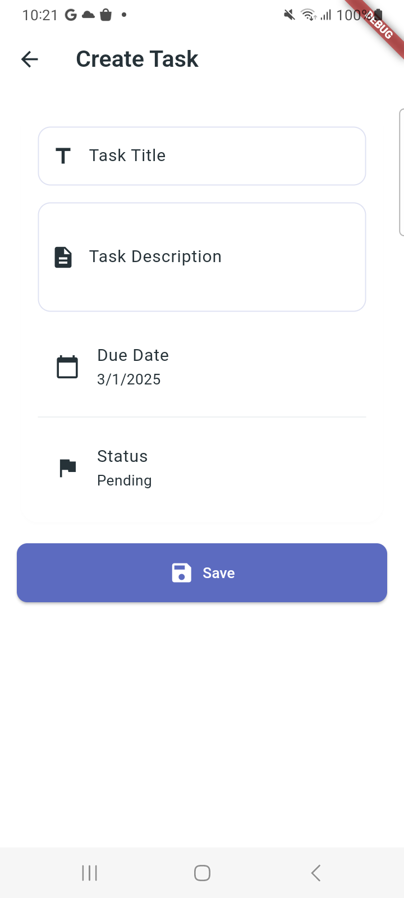
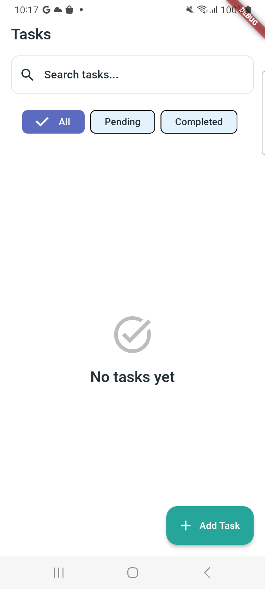
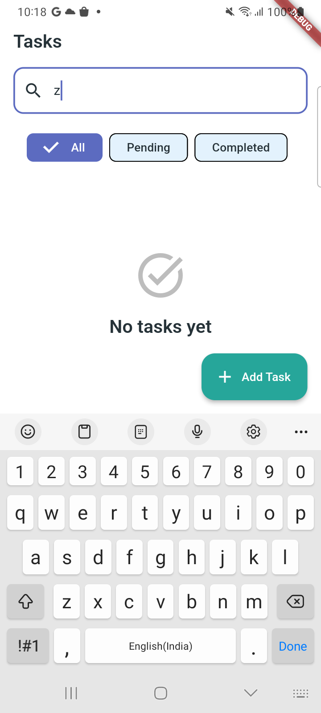
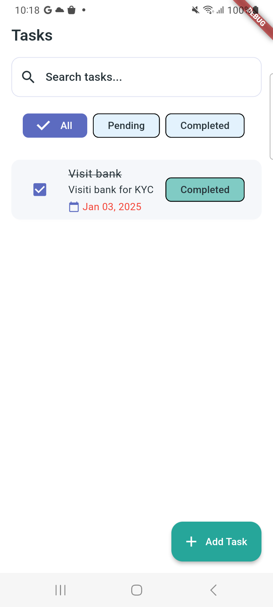

# 📱 Flutter Todo App with Clean Architecture & Provider

A modern, secure, and scalable task management application built with **Flutter 3.24.5**, embracing **clean architecture** and advanced state management for a seamless user experience.

---

## 🎯 **Key Features**

- 📝 **Task Creation & Management**: Add, edit, and organize tasks effortlessly.
- 🔍 **Advanced Search & Filters**: Quickly find tasks with robust search options.
- 🔒 **Secure Data Storage**: Encrypted local storage for enhanced security.
- 🏛️ **Clean Architecture**: Modular, testable, and scalable codebase.
- ⚡ **Performance Optimized**: Fast loading, 60 FPS animations, and minimal memory usage.

---

## 📂 **Directory Structure**

```plaintext
lib/
├── core/          # Core functionality
│   ├── constants/ # App-wide constants
│   └── enums/     # Status definitions
├── data/          # Data layer
│   ├── models/    # Data models
│   └── repositories/ # Data handling
├── domain/        # Business logic
│   └── entities/  # Core entities
└── presentation/  # UI layer
    ├── providers/ # State management
    ├── screens/   # App screens
    └── widgets/   # Reusable components

```

---

## 🛠️ **Tech Stack**

- **Framework**: Flutter 3.24.5
- **State Management**: Provider 6.1.x
- **Secure Storage**: `flutter_secure_storage` 9.0.x
- **Utilities**:
  - 📅 `intl` (Date formatting)
  - 🆔 `uuid` (Unique IDs)

---

## ⚙️ **Getting Started**

1. **Clone the Repository**

   ```bash
   git clone https://github.com/yourusername/todo_app.git
   cd todo_app
   ```

2. **Install Dependencies**

   ```bash
   flutter pub get
   ```

3. **Run the App**
   ```bash
   flutter run
   ```

---

## 🧪 **Testing**

- Run all tests:

  ```bash
  flutter test
  ```

- Generate coverage reports:
  ```bash
  flutter test --coverage
  ```

---

## 📸 **Screenshots**

### 📝 Task Creation

Easily add tasks with an intuitive workflow.

<p align="center">
  
</p>

### ✅ Task Management

Organize tasks seamlessly with advanced UI.

<p align="center">
  
</p>

### 🔍 Search & Filter

Find tasks quickly with dynamic filters.

<p align="center">
  
</p>

Complete tasks quickly with Checkbox.

<p align="center">
  
</p>

---

## Apk File

[APK](https://github.com/MobileApp-Dev-Kombee/todo_app_provider/blob/main/android/app-release.apk)

## 🤝 **Contributing**

We welcome contributions! Follow these steps to contribute:

1. Fork the repository.
2. Create a new branch for your feature/fix.
3. Commit changes and open a **Pull Request**.

---

## 📜 **License**

This project is licensed under the [MIT License](LICENSE).

---

## 👨‍💻 **Author**

**Kombee Technologies**

- 🌐 [Portfolio](https://github.com/kombee-technologies)
- 💼 [LinkedIn](https://in.linkedin.com/company/kombee-global)
- 🌍 [Website](https://www.kombee.com/)

---

<p align="center">
  Built with ❤️ using Flutter
</p>

---
